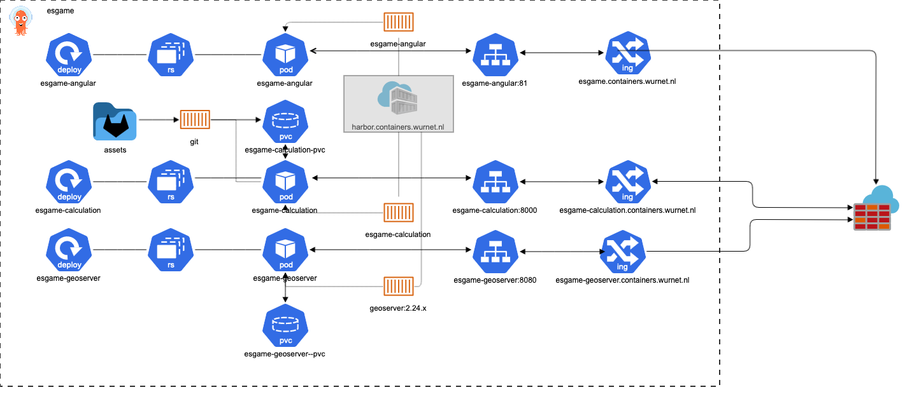

# PLACES - Participatory Landscape Configuration Effects Simulator

## project resources

PLACES is a tool in a webbrowser which uses an angular application combined with a an application written in R which both use a Goeserver instance for storing Geodata images.

<table class="relative-table wrapped confluenceTable" style="width: 37.656%;"><colgroup><col style="width: 17.0896%;"/><col style="width: 82.888%;"/></colgroup><tbody>

<tr>
<td>project</td>
<td>places</td>
</tr>

<tr>
<td>git repos</td>
<td><a class="external-link" href="https://github.com/s-gebhardt/places" rel="nofollow">https://github.com/s-gebhardt/places</a></td>
</tr>

<tr>
<td>version</td>
<td>test</td>
</tr>

<tr>
<td>Container image</td>
<td>
<a class="external-link" href="docker.osgeo.org/geoserver:2.24.x" rel="nofollow">docker.osgeo.org/geoserver:2.24.x</a> <a href="rstudio/plumber" rel="nofollow">rstudio/plumber</a>

 
</td>
</tr>

<tr>
<td>Github repos</td>
<td>
<a class="external-link" href="https://github.com/Vangelis96/esgame.git" rel="nofollow">https://github.com/Vangelis96/esgame.git</a> <a class="external-link" href="https://github.com/geoserver/docker" rel="nofollow">https://github.com/geoserver/docker</a>
</td>
</tr>

</tbody></table>

## Deployment

<td>

</td>

To deploy PLACES to your container environment do the following steps

1. Build the images in the docker_images directory according to the README in that folder
2. Push images to container registry of your choice
3. go into the /kubernetes_deployment/base/esgame folder
4. Change the -deploy.yaml and -ingress.yaml files to your specs
5. go into the /kubernetes_deployment/base folder 
6. kubectl apply -k .

## Changes in Angular App

If a change has been made in the game itself, for instance in the data.json file the esgame container also has to be rebuild.
